BrickDock
=========

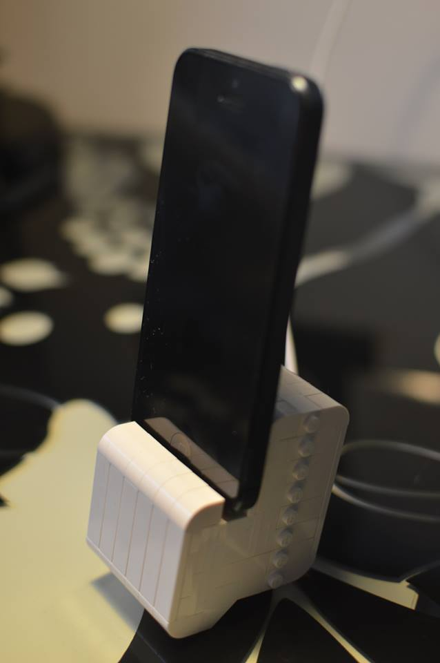

An Dock compatible with the iPhone 5 made from Lego.

Needed Bricks
-------------

All Parts exept the Apple Lightning Cable are available on Legos [Pick a Brick website](http://shop.lego.com/en-US/Pick-A-Brick-ByTheme).

×2
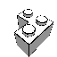×4
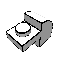×28
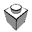×1
×6
×2
×2
×6
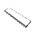×6
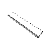×6
×2
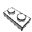×4
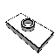×2
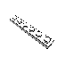×5
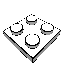×5
×4
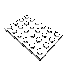×2
×4
×1

Step-by-Step
------------

### Back rest ###

1. 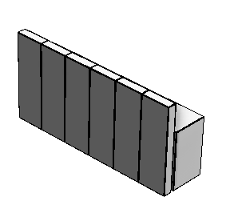
2. 

### Spine ###

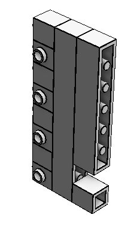 

### Font ###

1. 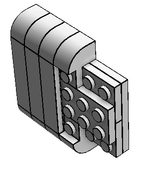
2. 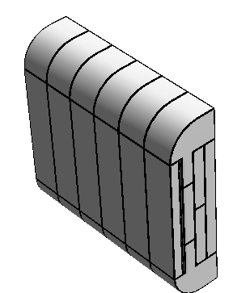

### Base ###

1. 
2. 

### Holder ###

1. 
2. 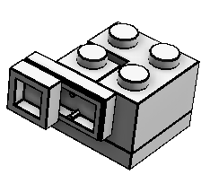 Build this twice
3. 
4. 

### Connect everything ###

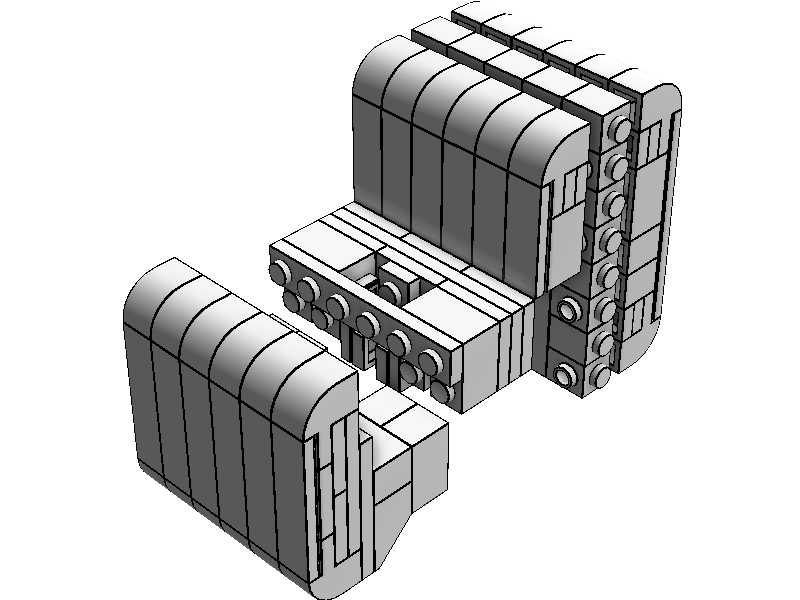
